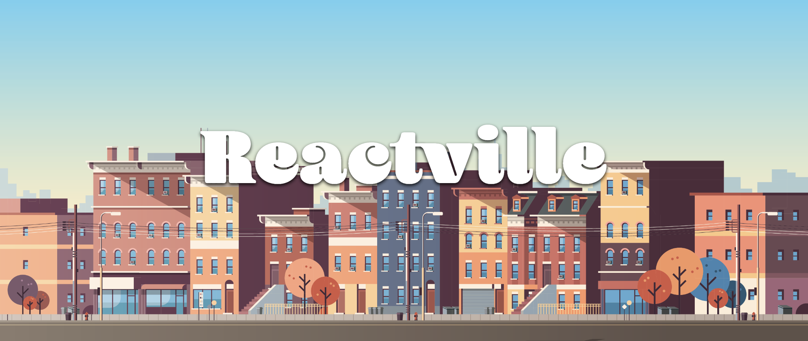

# Reactville

Reactville is a collection of user interfaces built with React. Each interface mirrors a business in the fictional town of Reactville, featuring establishments like a bank, market, post office, and more.

A deployed version of Reactville can be found [here](https://reactville.netlify.app/).

## Getting Started

1. Move to a directory of your choice.
2. Fork and clone the repository to your machine:

    ```bash
    gh repo fork https://github.com/whlong1/reactville --clone=true
    ```

3. Open the project in VS Code:

    ```bash
    cd reactville
    code .
    ```

4. Install the Node modules:

    ```bash
    npm i
    ```

5. In your terminal, start the React Dev Server:

    ```bash
    npm start
    ```